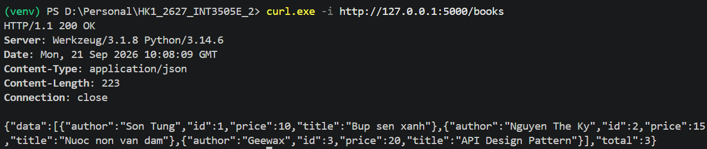
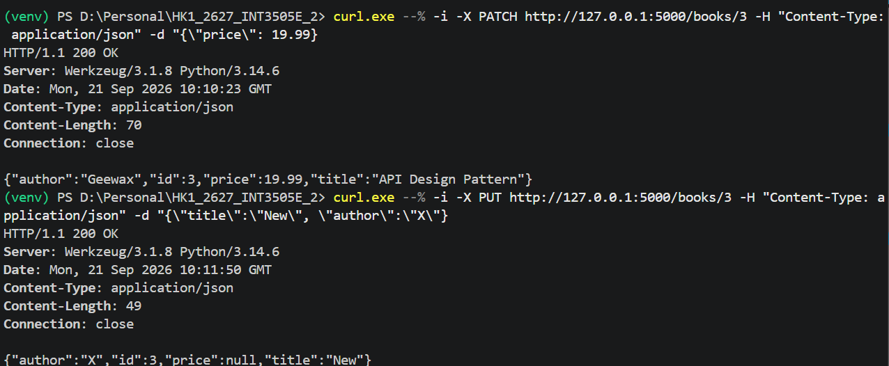
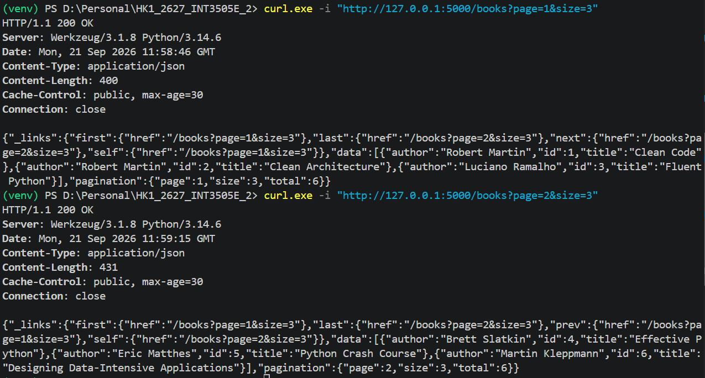

# LECTURE 02

## Problem 01

Figure 1.1: The return status codes are 201, 200. The initial list BOOKS is a empty list, I use method POST to add 2 new books into it. After that I use method GET to get all the book in the list.

Figure 1.2: The return status codes are 422, 400, and 415. To get the status code 422 UNPROCESSABLE ENTITY, I pass the data unsufficiently (without the title field). To get the status code 400 BAD REQUEST, I pass the data with an invalid JSON format. And to get the status code 415 UNSUPPORTED MEDIA TYPE, i don't pass the Content-Type.

## Problem 02

Figure 2.1: Using POST method to add 2 books into BOOKS.

Figure 2.2: Using PUT, PATCH, DELETE methods. Note that in the example about using PUT method, the passed data only includes 2 fields author and title. Therefore other fields will be set to null value. And if the method DELETE succeed, the return status code is 204 NO CONTENT.

 ## Problem 03
The API retrieve a collection of books with four main features:
- Filtering by author
- Searching titles with q
- Pagination with page and size
- HATEOAS navigation links such as prev, next, first, and last.

Initialize:
BOOKS = [
    {"id": 1, "title": "Clean Code", "author": "Robert Martin"},
    {"id": 2, "title": "Clean Architecture", "author": "Robert Martin"},
    {"id": 3, "title": "Fluent Python", "author": "Luciano Ramalho"},
    {"id": 4, "title": "Effective Python", "author": "Brett Slatkin"},
    {"id": 5, "title": "Python Crash Course", "author": "Eric Matthes"},
    {"id": 6, "title": "Designing Data-Intensive Applications", "author": "Martin Kleppmann"},
]

Figure 3.1: The initialized BOOKS includes 6 books, so when you send the size 3, it wil seperate into 2 pages. If the page is equal to 1, the data field includes the first three books in the BOOKS, and the _links only inlcudes first, last, self, and next fields. The same as the page 2.
