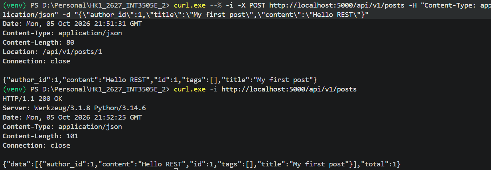

# LAB 01

## Identify the resources

users, posts, comments, tags, and following

## Classify collection, item and sub-resource

Collection: /users, /posts, /tags, ....
Item: /users/{user_id}, /posts/{post_id}, ...
Sub-resource: /users/{user_id}/posts, /users/{user_id}/following, /posts/{post_id}/comments, ...

## Design the endpoint tree
/api/v1
│
├── users
│   ├── GET  /users
│   ├── POST /users
│   │
│   └── /users/{user_id}
│       ├── GET
│       ├── PATCH
│       ├── DELETE
│       │
│       ├── /posts
│       │   └── GET
│       │
│       └── /following
│           ├── GET
│           └── /{target_user_id}
│               ├── PUT
│               └── DELETE
│
├── posts
│   ├── GET  /posts
│   ├── POST /posts
│   │
│   └── /posts/{post_id}
│       ├── GET
│       ├── PUT
│       ├── PATCH
│       ├── DELETE
│       │
│       ├── /comments
│       │   ├── GET
│       │   └── POST
│       │
│       └── /tags
│           ├── GET
│           ├── POST
│           └── DELETE
│
├── comments
│   └── /comments/{comment_id}
│       ├── GET
│       ├── PATCH
│       └── DELETE
│
└── tags
    ├── GET  /tags
    ├── POST /tags
    │
    └── /tags/{tag_id}
        ├── GET
        ├── DELETE
        └── /posts
            └── GET

## Implement Flask routes for collection /posts

Detailed implementation is in lab_01.py