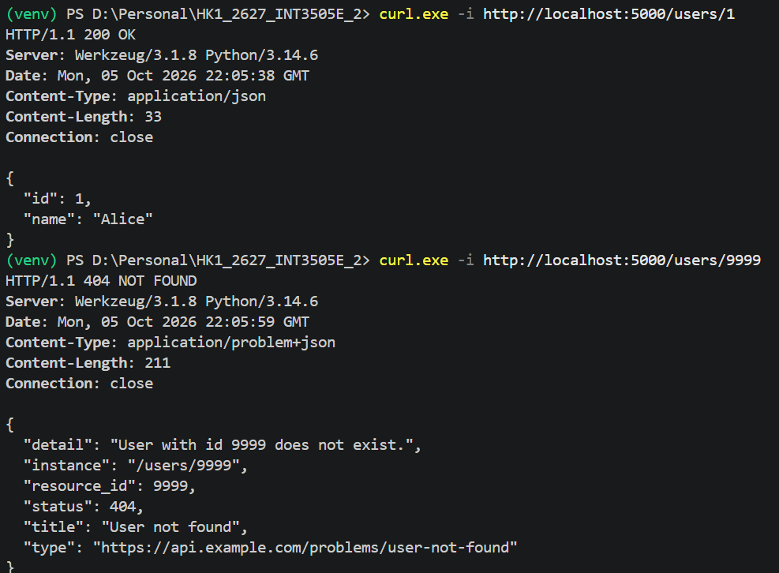
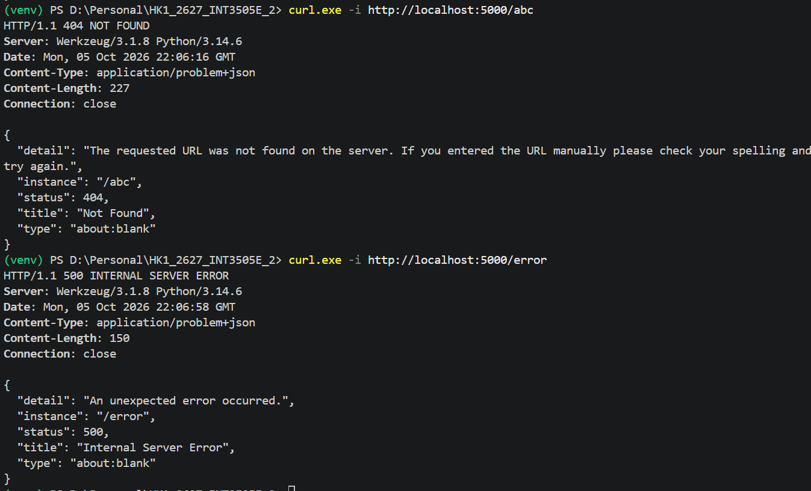

# LAB 02

The initial database contains 2 users: Alice (1) and Bob (2). You want to get user whose id is 9999, it will raise the ProblemError (user is None)

Similarly, while the 1st test case raises ProblemError, these two test cases raise HTTP Exception and Exception