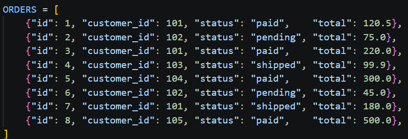
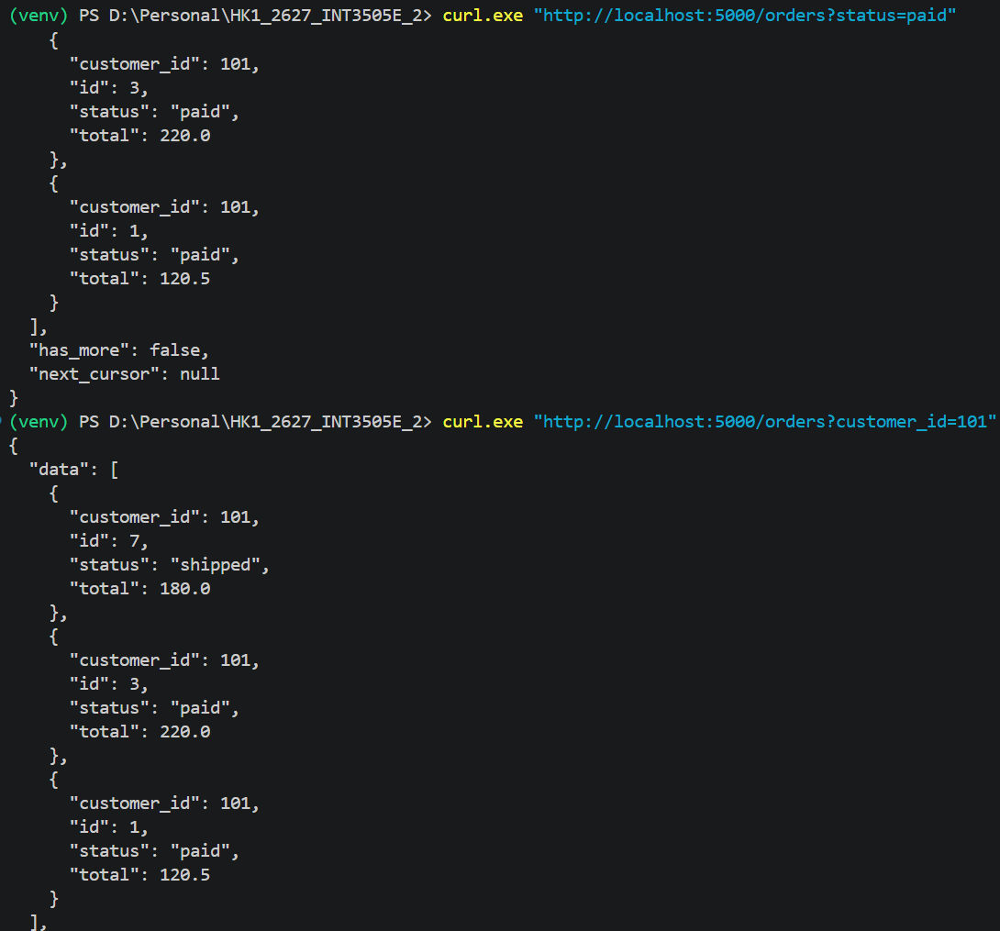
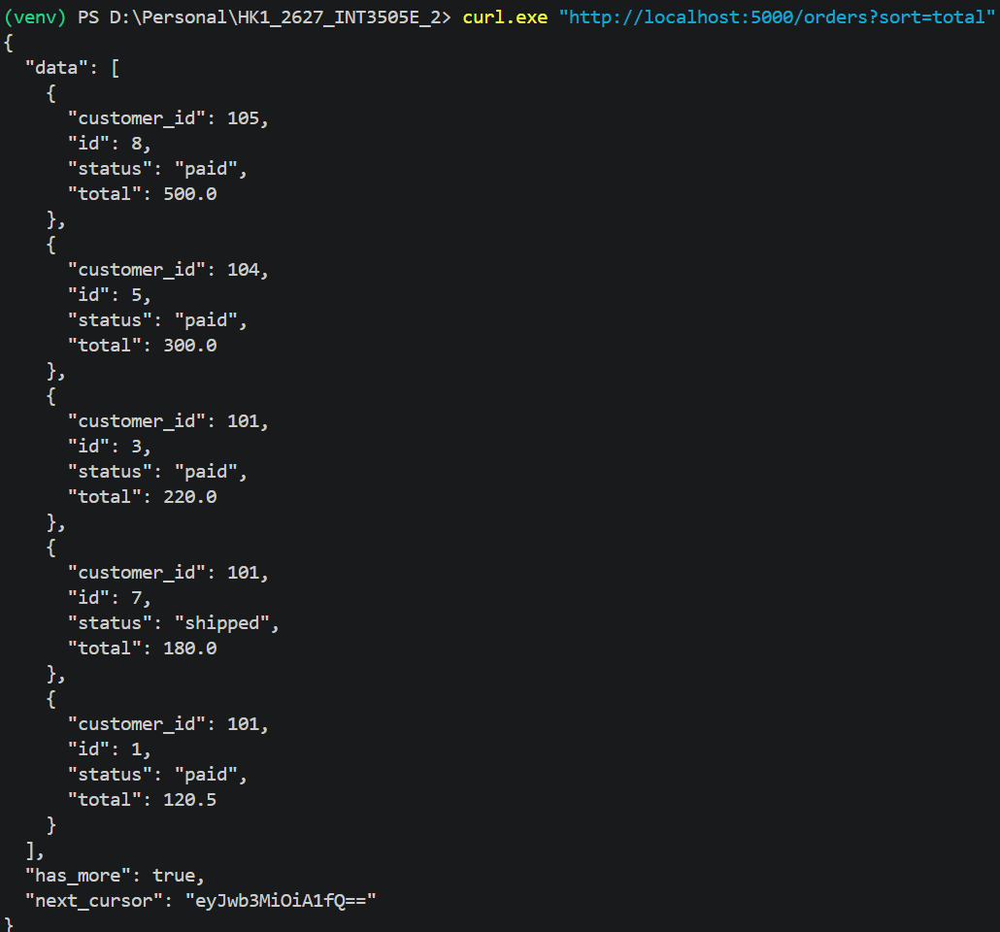
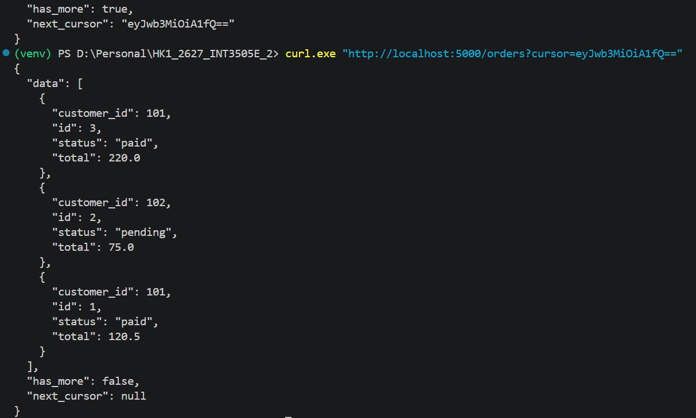
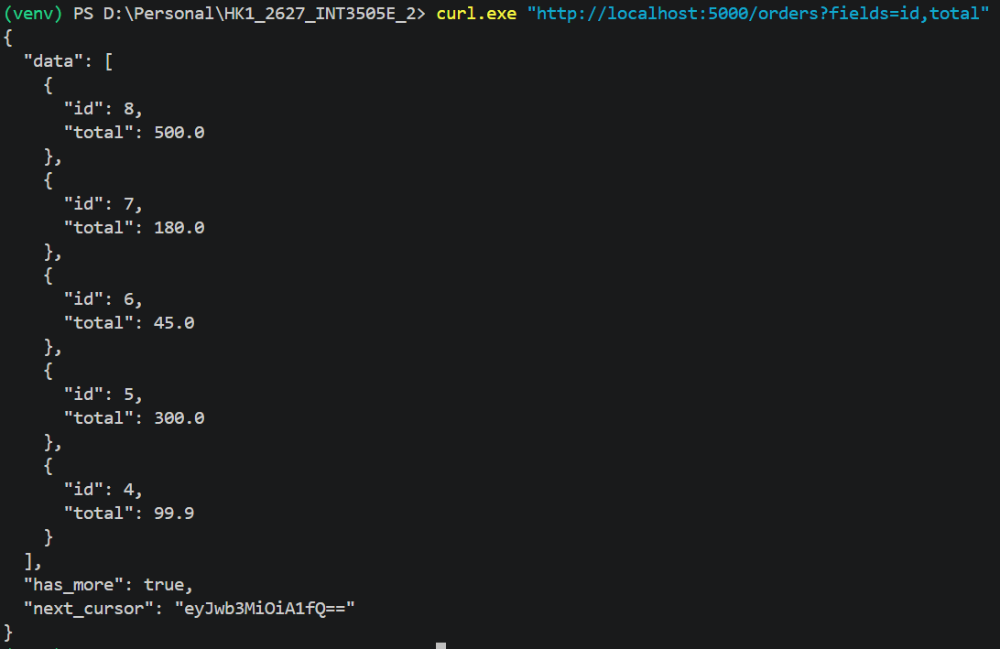
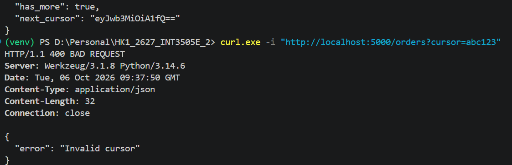

# LAB 03

## Initial database

## Filtering

## Sorting

## Cursor pagination

## Sparse Field

## Invalid cursor

The cursor returns in the previous query is eyJwb3MiOiA1fQ==. If you pass cursor=abc123 into the query parameter, you will receive the 400 BAD REQUEST response.